<h3>Compte Rendu TP Hopital</h3>
<h4>1/ Entities</h4>
<h5>1.1/ Consultation</h5>

<h5>1.2/ Medecin</h5>
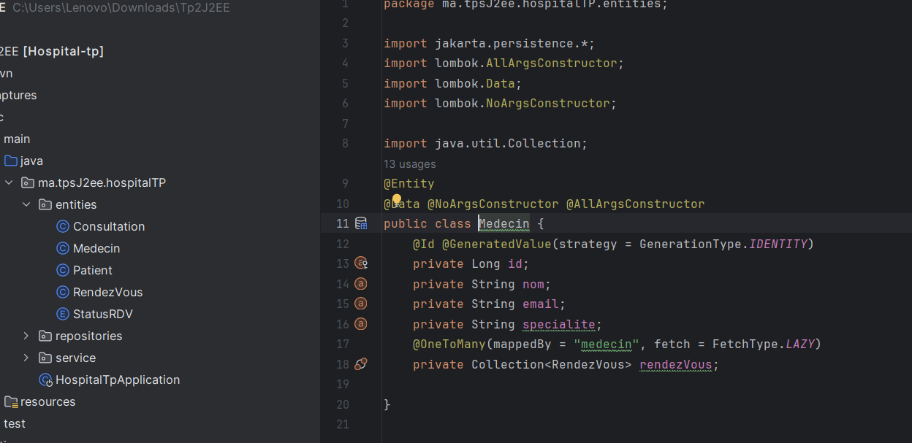
<h5>1.3/ Patient</h5>
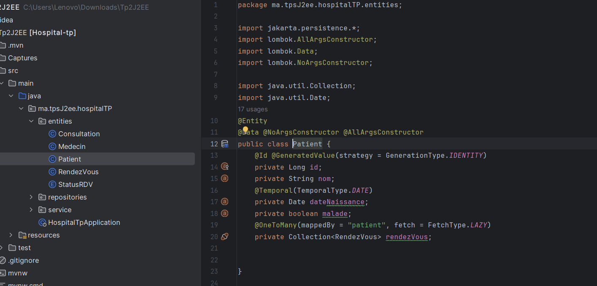
<h5>1.4/ Rendez Vous</h5>
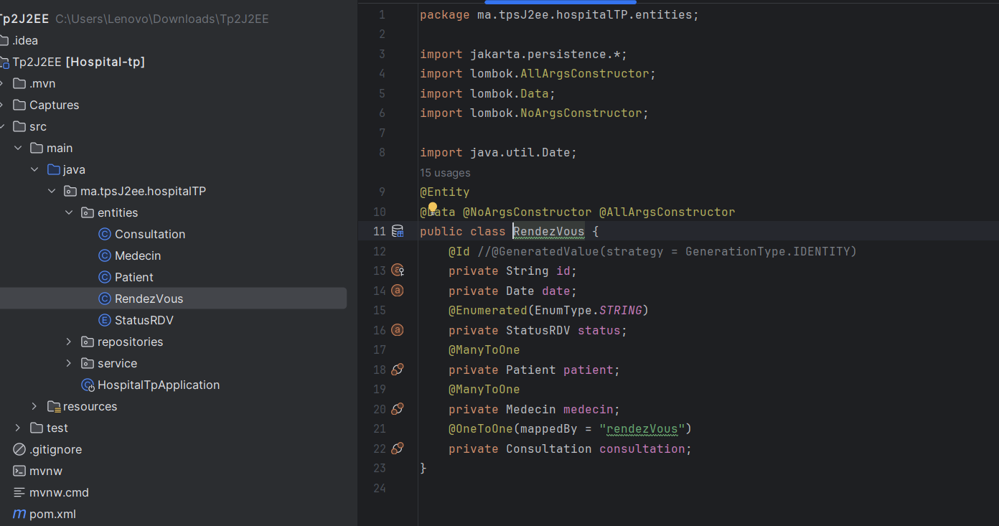
<h5>1.5/ Status RDV (ENUM)</h5>
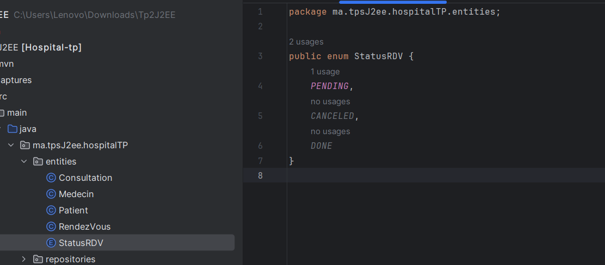
<h4>2/ Repositories</h4>
<h5>2.1/ Consultation</h5>
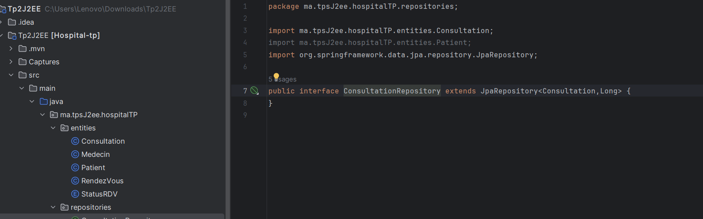
<h5>2.2/ Medecin</h5>
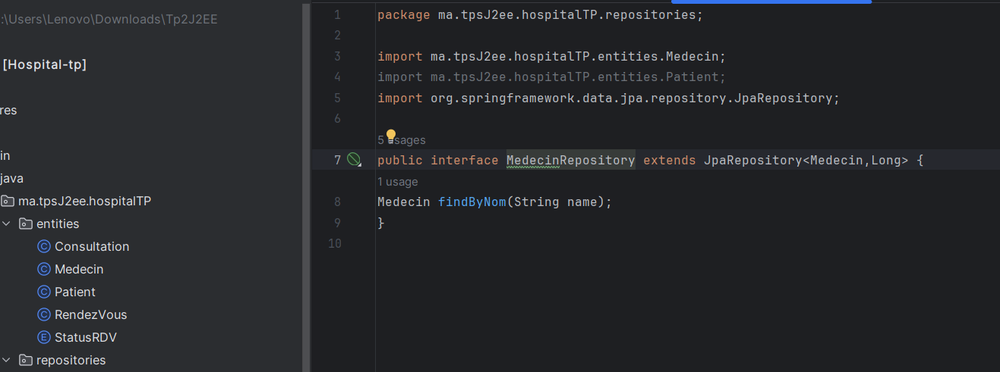
<h5>2.3/ Patient</h5>
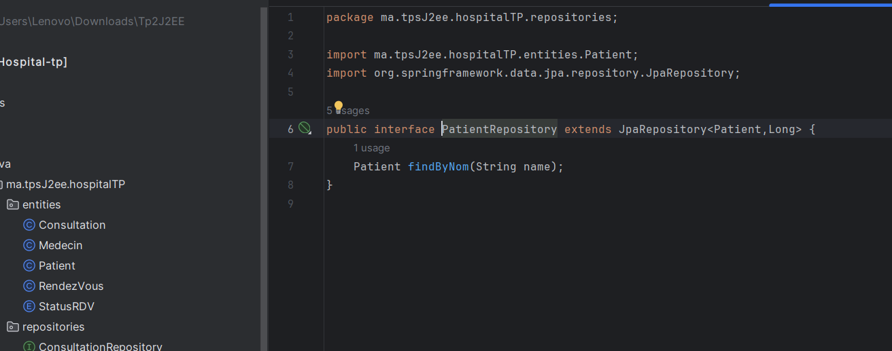
<h5>2.4/ RendezVous</h5>
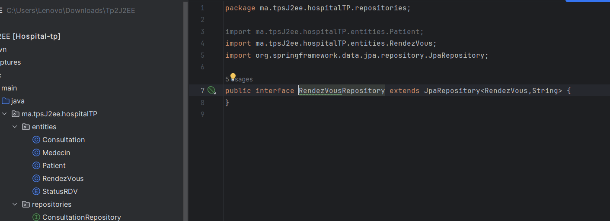
<h4>3/ Services</h4>
<h5>3.1/ Services Interface</h5>
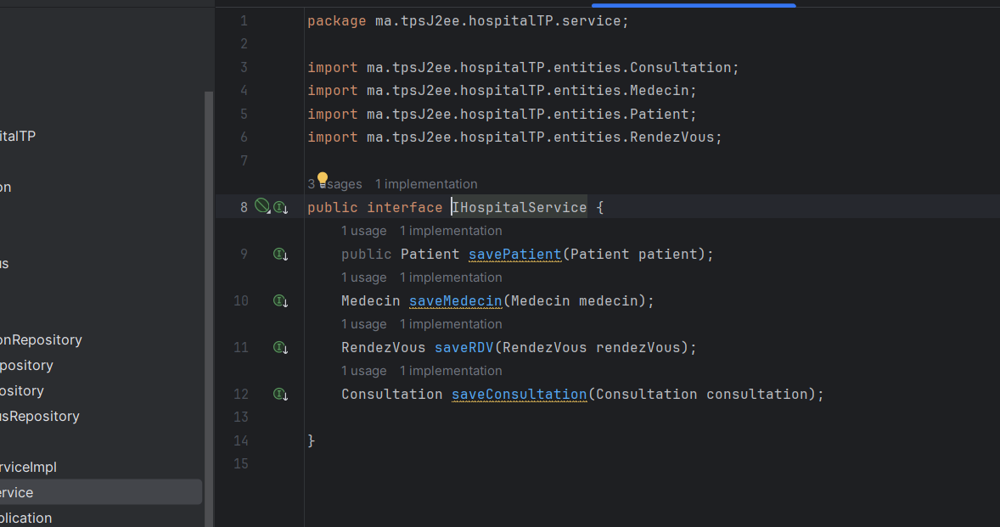
<h5>3.2/ Service Implementation</h5>
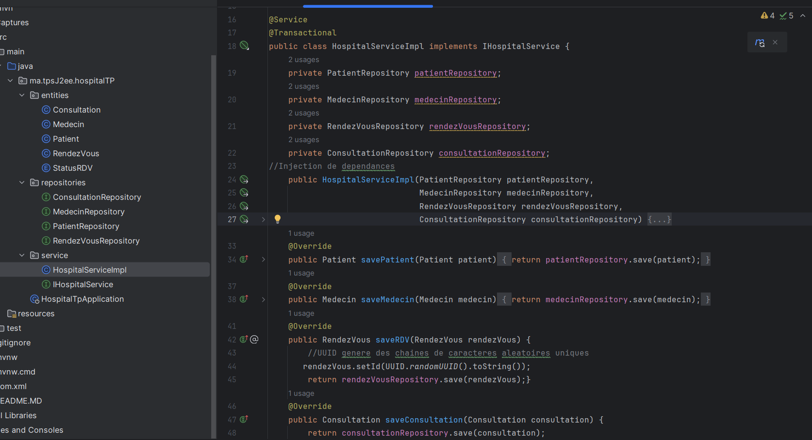
<h4>4/ Presentation</h4>

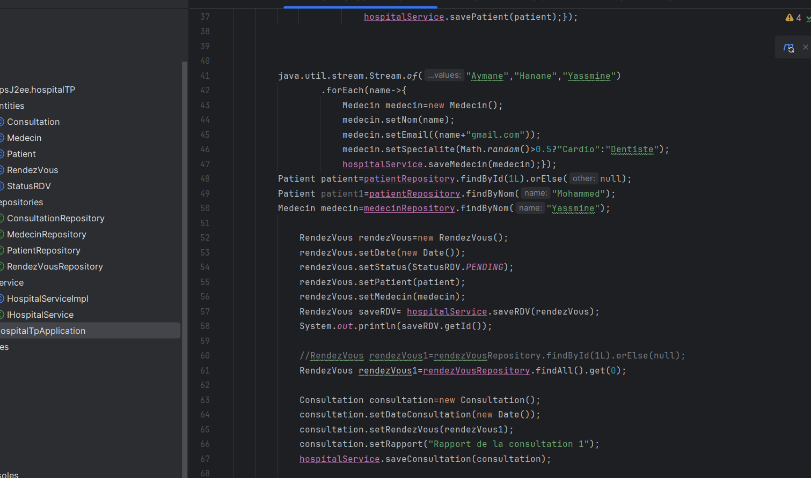
<h4>5/ Application Properties</h4>
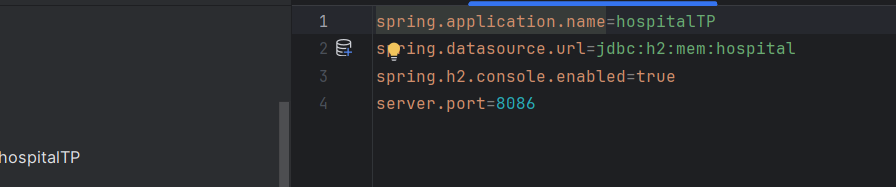
<h4>6/ Base de donnees apres execution</h4>
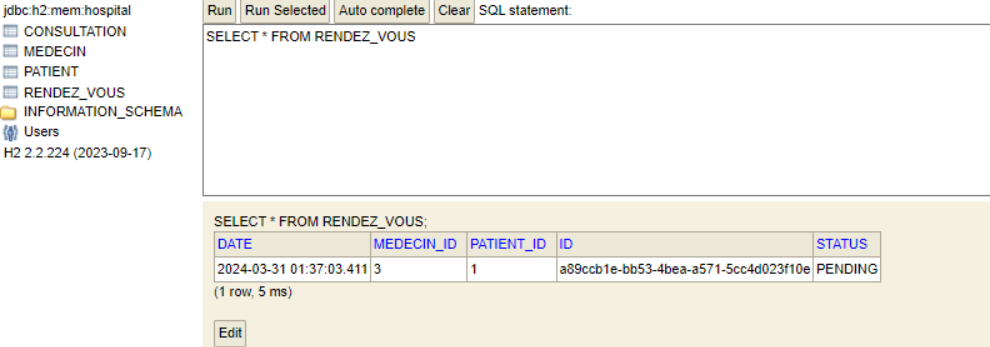
